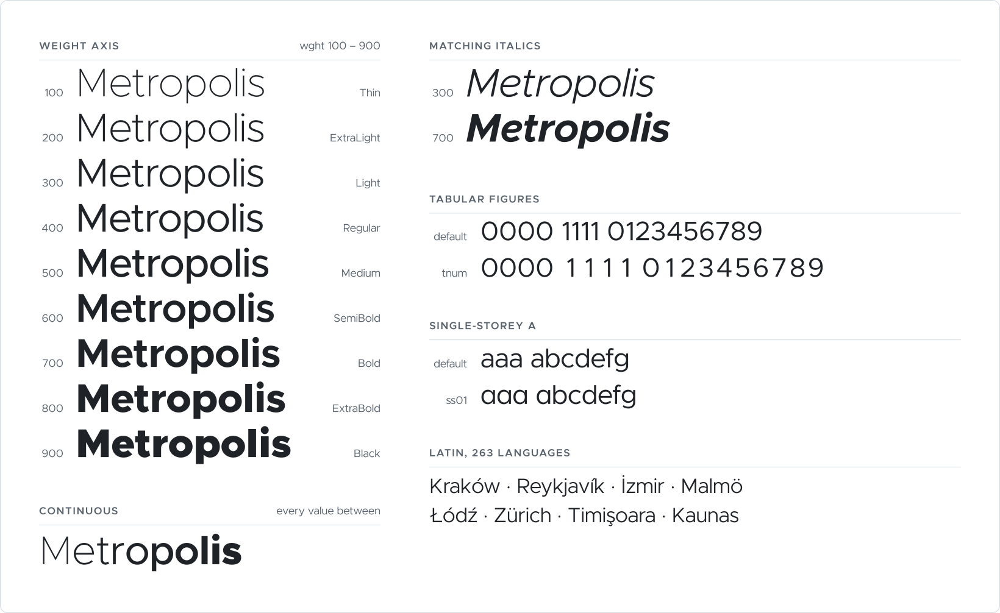

# Metropolis

[](https://github.com/sitapix/metropolis/actions/workflows/build.yml)

Metropolis is a geometric sans-serif in nine weights with matching italics,
released into the public domain. This repository is a fork of
[Chris Simpson's Metropolis](https://github.com/chrismsimpson/Metropolis) that
fixes the parts of the release that were broken or missing, and ships the built
fonts alongside the sources.

Outlines are unchanged from upstream r11. Rendered line height and baseline are
identical. What changed is metadata, structure, and the build.

- **Vertical metrics** that macOS does not override, so a line box is 1.21 em
  rather than the 1.2 em macOS substitutes for a font it reads as having none.
- **Variable fonts**, which fontmake refused to build from the upstream source.
  There are now two, roman and italic, `wght` 100–900.
- **Windows metrics** wide enough for the family's ink, which reaches -306 in
  Black Italic against a declared descent of 205.
- **A populated STAT table**, including an `ital` axis linking roman to italic.
- **OpenType features**: tabular figures, and a single-storey `a` that was
  already drawn but unreachable.
- **TTF and WOFF2 outputs** in addition to OTF.

[Changes from upstream r11](#changes-from-upstream-r11) covers each of these.

<picture>
  <source media="(prefers-color-scheme: dark)" srcset="./documentation/specimen-dark.svg">
  
</picture>

There is also an [interactive specimen](#specimen) with a weight slider.

## Installation

Nothing to compile. Take a zip from
[Releases](https://github.com/sitapix/metropolis/releases) — `-desktop` is the
OTFs, `-web` is the WOFF2, and the unsuffixed one is everything — or clone the
repository, where the built fonts are committed under `fonts/`.

```sh
git clone https://github.com/sitapix/metropolis.git
```

**On the web**, copy a WOFF2 out of `fonts/webfonts/` next to your CSS. One
variable file covers all nine weights:

| file | size |
|---|---|
| `Metropolis[wght].woff2` | 51 KB |
| `Metropolis-Italic[wght].woff2` | 55 KB |
| any single static weight, e.g. `Metropolis-Regular.woff2` | 20–25 KB |

**On the desktop**, install the OTFs from `fonts/otf/`: double-click a file and
confirm, or drag the folder into Font Book on macOS. Install the whole set for
the family to group correctly under one name.

## Usage

### Variable fonts

```css
@font-face {
  font-family: "Metropolis";
  src: url("Metropolis[wght].woff2") format("woff2-variations");
  font-weight: 100 900;
  font-style: normal;
}

@font-face {
  font-family: "Metropolis";
  src: url("Metropolis-Italic[wght].woff2") format("woff2-variations");
  font-weight: 100 900;
  font-style: italic;
}

body { font-family: Metropolis, sans-serif; }
h1   { font-weight: 900; }        /* or any value in 100–900 */
```

`wght` is the only axis, and it is continuous: `font-weight: 550` renders at
550, not at the nearest named weight.

### Static fonts

Declare each weight you use with its own `@font-face`. The nine named instances
are Thin 100, ExtraLight 200, Light 300, Regular 400, Medium 500, SemiBold 600,
Bold 700, ExtraBold 800, Black 900.

```css
@font-face {
  font-family: "Metropolis";
  src: url("Metropolis-Regular.woff2") format("woff2");
  font-weight: 400;
  font-style: normal;
}
```

### OpenType features

| feature | effect | how to turn it on |
|---|---|---|
| `kern` | pair kerning | on by default |
| `mark` | mark-to-base positioning | on by default |
| `tnum` | tabular (fixed-width) figures | `font-variant-numeric: tabular-nums` |
| `ss01` | single-storey `a` | `font-feature-settings: "ss01"` |
| `salt`, `aalt` | the same `a`, for apps that offer stylistic alternates | application UI |

```css
.table-of-numbers { font-variant-numeric: tabular-nums; }
.geometric-a      { font-feature-settings: "ss01"; }
```

`ss01` carries a `featureNames` entry, so applications that list stylistic sets
show it as "Single-storey a" rather than "Set 1".

Absent: `frac`, `onum`, `smcp`. Each needs glyphs that do not exist in the
source. `liga` is absent because `f` spans x 30–333 within a 344 advance, so
`fi` and `fl` do not collide. `zero` is absent because the Black counter is 248
units across inside a 200-unit ring, and a slash heavy enough to read closes it.

## Repository layout

| path | contents |
|---|---|
| `fonts/variable/` | 2 variable fonts, `wght` 100–900 |
| `fonts/otf/` | 18 static OTF |
| `fonts/ttf/` | 18 static TTF |
| `fonts/webfonts/` | WOFF2 built from the TTFs, 20 files |
| `sources/` | 2 Glyphs files, roman and italic |
| `scripts/` | build steps that fontmake does not cover |
| `specimen/` | the interactive specimen site |
| `documentation/` | the specimen image above, light and dark |

`sources/` is upstream r11 as of this repository's first commit, plus the
tabular figures.

| | |
|---|---|
| masters | Thin 100, Regular 400, Black 900, roman and italic |
| instances | 9 per file |
| glyphs | 339 |
| UPM | 1000 |
| kerning | 7381, 7523 and 6934 pairs, by roman master |

## Building from source

You only need this if you are changing the fonts. The outputs are committed.

**Requirements:** [uv](https://docs.astral.sh/uv/) and Python 3.12. Versions
are pinned in `requirements.txt` (fontmake 3.12.1, brotli 1.2.0, uharfbuzz
0.56.0); CI builds on Ubuntu with the same pins. The specimen site additionally
needs [Bun](https://bun.sh).

```sh
make venv     # create .venv and install the pinned toolchain
make          # static OTF, static TTF, variable, then WOFF2 for the TTFs
make check    # assert the metadata that upstream got wrong stays fixed
```

The `static`, `ttf`, `variable` and `webfonts` targets each build one output
kind. `make specimen` and `make specimen-image` build the specimen site and the
README image. `make dist VERSION=1.0.0` packs the release archives into `dist/`.
`make clean` removes `fonts/`, the built site, `dist/`, and fontmake's
intermediates.

`scripts/check_fonts.py` runs over every built file and asserts: a 1210 line
box, `typo` metrics matching `hhea`, win metrics containing `head.yMin` and
`yMax`, `USE_TYPO_METRICS` set with OS/2 version 4 or higher, ascent plus
descent not equal to the UPM, no single-valued `fvar` axis, a populated STAT
table, and STAT carrying `ital`.

`make variable` calls `scripts/postprocess_vf.py`, which writes the STAT axis
values and the `ital` axis that fontmake omits, and `make webfonts` calls
`scripts/make_webfonts.py`, which compresses the variable and static TTFs.

`make specimen-image` calls `scripts/make_specimen_image.py`, which writes
`documentation/specimen-{light,dark}.svg`. HarfBuzz shapes the text, so the
`tnum` and `ss01` rows show the font's own features rather than a mock-up, and
every outline is written out as a path, so the image needs no webfont.

`scripts/make_dist.py` packs the release archives. Entries are sorted,
permissions are fixed, and timestamps come from `SOURCE_DATE_EPOCH` or the
current commit, so building a tag twice produces the same bytes.

`scripts/add_tabular_figures.py` is not part of `make`: it writes the `.tnum`
glyphs into `sources/` rather than building from them. It has already been run
and its output is committed. Run it again only after changing the figures, and
commit the changed source with the rebuilt fonts.

## Specimen

`specimen/` holds an interactive specimen: a weight slider, a dropdown of the
nine named instances, an editable type tester, and the full character set.

It is published at **[sitapix.github.io/metropolis](https://sitapix.github.io/metropolis/)**
on every push to `main` that touches `specimen/` or `fonts/webfonts/`.

```sh
make specimen                 # build it to specimen/_site
cd specimen && bun run start  # or serve it at localhost:8080 with live reload
```

It is [Specimen Builder](https://github.com/markboulton/specimen-builder) by
Mark Boulton, vendored under `specimen/` and configured for Metropolis. Three
fixes were needed to make it run on a current toolchain, all described in
[`specimen/README.md`](./specimen/README.md); the one worth knowing about here
is that fontkit cannot resolve an `fvar` instance whose `subfamilyNameID` is 2
or 17, which is what the OpenType spec asks for on the default instance and
what Metropolis does. The font is correct; the fix is in the generator.

`specimen/src/fonts/` is populated by `make specimen` from `fonts/webfonts/`,
so the WOFF2 files are not committed twice.

## Changes from upstream r11

**Vertical metrics.** Upstream declared `hhea` and `typo` as `795 / -205` with
`lineGap 0`, summing to 1000, which equals the UPM. macOS treats a font whose
ascent plus descent equals the em as having no line metrics and substitutes a
1.2 em line box. `NSFont.ascender - descender` returned 1.0 em while
`NSLayoutManager.defaultLineHeight` returned 1.2 em. Now `1000 / -210 / 0`,
summing to 1210. Measured at 100 pt, before and after: line fragment 121,
baseline 100 from the top.

**Windows clipping.** `usWinDescent` was 205. Family ink reaches -306 in Black
Italic, so Ģ Ķ Ņ Ŗ ģ ķ ņ ŗ clipped in the heavy weights. Now `1000 / 310`.

**Variable build failed.** `cent` and `dollar` carry a bracket layer above
`wght 700` splitting the vertical bar into two stubs. Regular and Black had the
bracket, Thin did not, so `cent.BRACKET.varAlt01` had 3 contours at two masters
and 2 at the third. fontmake rejected it. The bars are 4-node parallelograms and
the stub gap closes linearly with weight (Regular 13–504, Black 43–473), so
Thin's cut heights extrapolate off that slope. Italic bars slant 11.75°, so
moved nodes offset in x by `dy * tan`.

**Single-valued axes.** Both sources declared a `Width` axis with every master
and instance at one value. The italic carried a third undeclared coordinate at
one value. `fvar` shipped `wdth 100..100..100`. Removed; `wght` is the only axis
that varies.

**STAT had no axis values.** fontmake emits the `wght` axis record and no
`AxisValue` entries, and no `ital` axis. Built in `scripts/postprocess_vf.py`.
Roman and italic have incompatible masters and cannot share an `ital` axis in
`fvar`, so STAT links them instead:

```
Metropolis[wght].ttf          wght 100..900, ital 0, LinkedValue 1
Metropolis-Italic[wght].ttf   wght 100..900, ital 1
```

**Stems incomplete.** The font declares 8 stems. Black filled all 8, Regular 6,
Thin 2. Glyphs exported 2 of 18 instances and failed the rest with "Stems can't
be zero". All three masters now carry 4 horizontal and 4 vertical values.

**GSUB empty.** No substitution features at all. `kern` and `mark` came from the
kerning data and anchors, but the single-storey `a` was drawn and unreferenced,
and there were no tabular figures. `ss01`, `salt` and `aalt` now reach the
existing alternates. `tnum` re-centres each figure in the widest figure's
advance (`zero`: 674, 683, 736 by master), leaving outlines untouched; it
follows components, because `nine` is a rotated `six` with no paths of its own.

In the variable fonts, `cent` and `dollar` substitute via GSUB feature
variations at `wght 700..900`, which is where the `rvrn` feature comes from.

## Contributing

Issues and pull requests are welcome at
[github.com/sitapix/metropolis](https://github.com/sitapix/metropolis).

Before opening a pull request, run `make && make check`. CI runs `make check`
against the committed binaries first, then rebuilds and checks again, so a
change to `sources/` or `scripts/` needs the rebuilt fonts committed with it.
It also regenerates the README specimen and fails if `documentation/` has
drifted, so run `make specimen-image` after changing the fonts or the generator.

The two workflows are gated on the paths they actually depend on: a change to
`specimen/` does not run fontmake, and a change to `sources/` does not rebuild
the site.

If a change is meant to hold, add the assertion to `scripts/check_fonts.py`.
The vertical metrics, the Windows clipping, the single-valued axis and the STAT
table each have one, so CI fails if any of them regresses.

## Acknowledgements

Metropolis was designed by [Chris Simpson](https://github.com/chrismsimpson).
This fork changes no outlines; the drawing is entirely his.

## License

[Unlicense](./UNLICENSE), inherited from upstream. Public domain: use it for
anything, with or without attribution.

`specimen/` is the exception: it is vendored from Specimen Builder and stays
under the [Apache License 2.0](./specimen/LICENSE.txt) it was published with.
