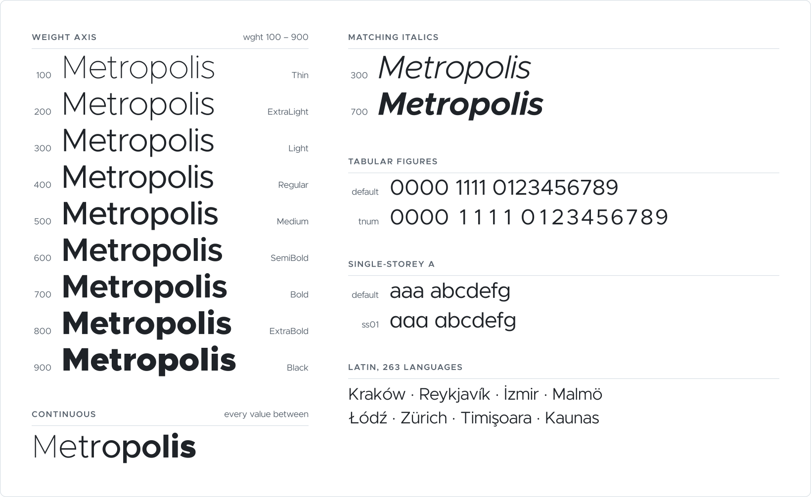

# Metropolis

[](https://github.com/sitapix/metropolis/actions/workflows/build.yml)

Metropolis is a geometric sans-serif in nine weights with matching italics,
released into the public domain. This repository is a fork of
[Chris Simpson's Metropolis](https://github.com/chrismsimpson/Metropolis) that
fixes the parts of the release that were broken or missing, and ships the built
fonts alongside the sources.

Upstream r11's outlines are unchanged, and rendered line height and baseline
are identical. What changed is metadata, structure, the build, and the
characters upstream never drew.

- **Vertical metrics** that macOS does not override, so a line box is 1.21 em
  rather than the 1.2 em macOS substitutes for a font it reads as having none.
- **Variable fonts**, which fontmake refused to build from the upstream source.
  There are now two, roman and italic, `wght` 100–900.
- **Windows metrics** wide enough for the family's ink, which reaches -306 in
  Black Italic against a declared descent of 205.
- **A populated STAT table**, including an `ital` axis linking roman to italic.
- **OpenType features**: tabular figures, and a single-storey `a` that was
  already drawn but unreachable.
- **The rest of Windows-1252**, plus Latvian Ļ ļ, Romanian Ș ș Ț ț, and the
  no-break space that every `&nbsp;` on the web asks for.
- **Style linking** that gives Regular an Italic on Windows, **licence and
  designer names**, and installable embedding.
- **Hinting**: ttfautohint for TrueType, `otfautohint` for CFF.
- **TTF and WOFF2 outputs** in addition to OTF.

[Changes from upstream r11](#changes-from-upstream-r11) covers each of these.

<picture>
  <source media="(prefers-color-scheme: dark)" srcset="./documentation/specimen-dark.svg">
  
</picture>

There is also an [interactive specimen](#specimen) to play with.

## Installation

Nothing to compile. Download `Metropolis-<version>.zip` from
[Releases](https://github.com/sitapix/metropolis/releases), or clone the
repository, where the built fonts are committed under `fonts/`. Both have the
same four folders: `otf/`, `ttf/`, `variable/` and `webfonts/`.

```sh
git clone https://github.com/sitapix/metropolis.git
```

**On the web**, copy a WOFF2 out of `fonts/webfonts/` next to your CSS. One
variable file covers all nine weights:

| file | size |
|---|---|
| `Metropolis[wght].woff2` | 55 KB |
| `Metropolis-Italic[wght].woff2` | 60 KB |
| any single static weight, e.g. `Metropolis-Regular.woff2` | 27–33 KB |

**On the desktop**, install the OTFs from `fonts/otf/` on macOS, or the TTFs
from `fonts/ttf/` on Windows, where their hinting renders better at small
sizes. Double-click a file and confirm, or drag the folder into Font Book.
Install the whole set for the family to group correctly under one name. Apps
that support variable fonts can use the two files in `fonts/variable/` instead.

## Usage

### Variable fonts

```css
@font-face {
  font-family: "Metropolis";
  src: url("Metropolis[wght].woff2") format("woff2-variations");
  font-weight: 100 900;
  font-style: normal;
}

@font-face {
  font-family: "Metropolis";
  src: url("Metropolis-Italic[wght].woff2") format("woff2-variations");
  font-weight: 100 900;
  font-style: italic;
}

body { font-family: Metropolis, sans-serif; }
h1   { font-weight: 900; }        /* or any value in 100–900 */
```

`wght` is the only axis, and it is continuous: `font-weight: 550` renders at
550, not at the nearest named weight.

### Static fonts

Declare each weight you use with its own `@font-face`. The nine named instances
are Thin 100, ExtraLight 200, Light 300, Regular 400, Medium 500, SemiBold 600,
Bold 700, ExtraBold 800, Black 900.

```css
@font-face {
  font-family: "Metropolis";
  src: url("Metropolis-Regular.woff2") format("woff2");
  font-weight: 400;
  font-style: normal;
}
```

### OpenType features

| feature | effect | how to turn it on |
|---|---|---|
| `kern` | pair kerning | on by default |
| `mark` | mark-to-base positioning | on by default |
| `tnum` | tabular (fixed-width) figures and `+ − × ÷ = < > ±` | `font-variant-numeric: tabular-nums` |
| `ss01` | single-storey `a` | `font-feature-settings: "ss01"` |
| `salt`, `aalt` | the same `a`, for apps that offer stylistic alternates | application UI |

```css
.table-of-numbers { font-variant-numeric: tabular-nums; }
.geometric-a      { font-feature-settings: "ss01"; }
```

`ss01` carries a `featureNames` entry, so applications that list stylistic sets
show it as "Single-storey a" rather than "Set 1".

U+2007 FIGURE SPACE has the tabular figure width, for padding a column.

Absent: `frac`, `onum`, `smcp`. ½ ¼ ¾ and ¹ ² ³ exist as characters, but `frac`
needs a full set of numerator and denominator figures that the source does not
have. `liga` is absent because `f` spans x 30–333 within a 344 advance, so
`fi` and `fl` do not collide. `zero` is absent because the Black counter is 248
units across inside a 200-unit ring, and a slash heavy enough to read closes it.

## Repository layout

| path | contents |
|---|---|
| `fonts/variable/` | 2 variable fonts, `wght` 100–900 |
| `fonts/otf/` | 18 static OTF |
| `fonts/ttf/` | 18 static TTF |
| `fonts/webfonts/` | WOFF2 built from the TTFs, 20 files |
| `sources/` | 2 Glyphs files, roman and italic |
| `scripts/` | build steps that fontmake does not cover |
| `specimen/` | the interactive specimen site |
| `documentation/` | the specimen image above, light and dark |

`sources/` is upstream r11 as of this repository's first commit, plus the
tabular figures and [the added characters](#changes-from-upstream-r11).

| | |
|---|---|
| masters | Thin 100, Regular 400, Black 900, roman and italic |
| instances | 9 per file |
| glyphs | 373, of which 361 export and 333 are encoded |
| UPM | 1000 |
| kerning | 7381, 7523 and 6934 pairs, by roman master |

## Building from source

You only need this if you are changing the fonts. The outputs are committed.

**Requirements:** [uv](https://docs.astral.sh/uv/) and Python 3.12. Versions
are pinned in `requirements.txt` (fontmake 3.12.1, brotli 1.2.0, uharfbuzz
0.56.0, afdko 5.0.1 for `otfautohint`, ttfautohint-py 0.6.1); CI builds on
Ubuntu with the same pins. The specimen site additionally
needs [Bun](https://bun.sh).

```sh
make venv     # create .venv and install the pinned toolchain
make          # static OTF, static TTF, variable, then WOFF2 for the TTFs
make check    # assert the metadata that upstream got wrong stays fixed
```

The `static`, `ttf`, `variable` and `webfonts` targets each build one output
kind. `make specimen` and `make specimen-image` build the specimen site and the
README image. `make dist VERSION=1.0.0` packs the release archive into `dist/`.
`make clean` removes `fonts/`, the built site, `dist/`, and fontmake's
intermediates.

`scripts/check_fonts.py` runs over every built file and asserts: a 1210 line
box, `typo` metrics matching `hhea`, win metrics containing `head.yMin` and
`yMax`, `USE_TYPO_METRICS` set with OS/2 version 4 or higher, ascent plus
descent not equal to the UPM, copyright, designer and licence names, `fsType`
0, the Italic linked to Regular, full Windows-1252 plus Ļ ļ Ș ș Ț ț, no
unreachable bracket glyphs in the static fonts, `latn` in GSUB, tabular math
and figure space at the tabular figure width, hinting, no single-valued `fvar`
axis, a populated STAT table, STAT carrying `ital`, and `fvar` instance names
that agree with the font's own.

`make static` and `make ttf` call `scripts/postprocess_static.py`, which drops
the `cent` and `dollar` bracket alternates that a static instance cannot reach.
`make static` then hints the CFF with `otfautohint` and re-subroutinises it
with `cffsubr`; `make ttf` hints with ttfautohint through fontmake's
`--autohint`. `make variable` calls `scripts/postprocess_vf.py`, which writes
the STAT axis values and the `ital` axis that fontmake omits, names the `fvar`
instances, and adds `gasp` and a smart-dropout `prep`, since ttfautohint cannot
hint a variable font. `make webfonts` calls `scripts/make_webfonts.py`, which
compresses the variable and static TTFs.

`make specimen-image` calls `scripts/make_specimen_image.py`, which writes
`documentation/specimen-{light,dark}.svg`. HarfBuzz shapes the text, so the
`tnum` and `ss01` rows show the font's own features rather than a mock-up, and
every outline is written out as a path, so the image needs no webfont.

`scripts/make_dist.py` packs the release archive. Entries are sorted,
permissions are fixed, and timestamps come from `SOURCE_DATE_EPOCH` or the
current commit, so building a tag twice produces the same bytes.

`scripts/extend_charset.py` and `scripts/add_tabular_figures.py` are not part
of `make`: they write glyphs into `sources/` rather than building from them.
Both have been run and their output is committed. Run them again, in that
order, only after changing the glyphs they build from, and commit the changed
sources with the rebuilt fonts.

## Specimen

`specimen/` holds an interactive specimen: a type playground with weight, size,
spacing, feature and colour controls and shareable links, the nine weights,
live OpenType demos, a glyph inspector, and a searchable language list.

It is published at **[sitapix.github.io/metropolis](https://sitapix.github.io/metropolis/)**
on every push to `main` that touches `specimen/` or `fonts/webfonts/`.

```sh
make specimen                 # build it to specimen/_site
cd specimen && bun run start  # or serve it at localhost:8080 with live reload
```

It is [Specimen Builder](https://github.com/markboulton/specimen-builder) by
Mark Boulton, vendored under `specimen/` and configured for Metropolis. Three
fixes were needed to make it run on a current toolchain, all described in
[`specimen/README.md`](./specimen/README.md); the one worth knowing about here
is that fontkit cannot resolve an `fvar` instance whose `subfamilyNameID` is 2
or 17, which is what the OpenType spec asks for on the default instance and
what Metropolis does. The font is correct; the fix is in the generator.

`specimen/src/fonts/` is populated by `make specimen` from `fonts/webfonts/`,
so the WOFF2 files are not committed twice.

## Changes from upstream r11

**Vertical metrics.** Upstream declared `hhea` and `typo` as `795 / -205` with
`lineGap 0`, summing to 1000, which equals the UPM. macOS treats a font whose
ascent plus descent equals the em as having no line metrics and substitutes a
1.2 em line box. `NSFont.ascender - descender` returned 1.0 em while
`NSLayoutManager.defaultLineHeight` returned 1.2 em. Now `1000 / -210 / 0`,
summing to 1210. Measured at 100 pt, before and after: line fragment 121,
baseline 100 from the top.

**Windows clipping.** `usWinDescent` was 205. Family ink reaches -306 in Black
Italic, so Ģ Ķ Ņ Ŗ ģ ķ ņ ŗ clipped in the heavy weights. Now `1000 / 310`.

**Variable build failed.** `cent` and `dollar` carry a bracket layer above
`wght 700` splitting the vertical bar into two stubs. Regular and Black had the
bracket, Thin did not, so `cent.BRACKET.varAlt01` had 3 contours at two masters
and 2 at the third. fontmake rejected it. The bars are 4-node parallelograms and
the stub gap closes linearly with weight (Regular 13–504, Black 43–473), so
Thin's cut heights extrapolate off that slope. Italic bars slant 11.75°, so
moved nodes offset in x by `dy * tan`.

**Single-valued axes.** Both sources declared a `Width` axis with every master
and instance at one value. The italic carried a third undeclared coordinate at
one value. `fvar` shipped `wdth 100..100..100`. Removed; `wght` is the only axis
that varies.

**STAT had no axis values.** fontmake emits the `wght` axis record and no
`AxisValue` entries, and no `ital` axis. Built in `scripts/postprocess_vf.py`.
Roman and italic have incompatible masters and cannot share an `ital` axis in
`fvar`, so STAT links them instead:

```
Metropolis[wght].ttf          wght 100..900, ital 0, LinkedValue 1
Metropolis-Italic[wght].ttf   wght 100..900, ital 1
```

**Stems incomplete.** The font declares 8 stems. Black filled all 8, Regular 6,
Thin 2. Glyphs exported 2 of 18 instances and failed the rest with "Stems can't
be zero". All three masters now carry 4 horizontal and 4 vertical values.

**GSUB empty.** No substitution features at all. `kern` and `mark` came from the
kerning data and anchors, but the single-storey `a` was drawn and unreferenced,
and there were no tabular figures. `ss01`, `salt` and `aalt` now reach the
existing alternates. `tnum` re-centres each figure in the widest figure's
advance (`zero`: 674, 683, 736 by master), leaving outlines untouched; it
follows components, because `nine` is a rotated `six` with no paths of its own.

In the variable fonts, `cent` and `dollar` substitute via GSUB feature
variations at `wght 700..900`, which is where the `rvrn` feature comes from.

**Characters missing.** There was no U+00A0 no-break space, so every `&nbsp;`
fell back to another font's space. Windows-1252 lacked
¤ ¦ § ª ¬ ± ² ³ µ ¹ º ¼ ½ ¾ ƒ † ‡. U+00AD SOFT HYPHEN stays out on purpose: the
renderer draws a hyphen at the break itself. OS/2 claimed Baltic and the font had Ģ Ķ Ņ Ŗ,
but not Ļ ļ. Romanian had only the cedilla forms Ş ş Ţ ţ, although
`commaaccentcomb` was in the font. `scripts/extend_charset.py` builds all of
them from each master's own parts, so they interpolate: components where a
glyph already has the shape (µ is `u` with a descender stem, ƒ is `f` over the
tail of `j`, § is two `s`), and rectangles measured from `bar`, `plus` and
`minus` where none does. The superiors, fractions, ordinals, § ¤ ƒ µ and the
fraction slash are constructions rather than drawings, and carry a magenta
label in Glyphs for review.

**Italic not linked to Regular.** The Regular Italic instance was style-linked
to "Regular", so its name1 was "Metropolis Regular" and Windows grouped
Regular, Bold and Bold Italic with no Italic. It is now the "Italic" of
"Metropolis", `Metropolis-Italic`, matching the variable font.

**Names and embedding.** name IDs 0, 9, 13 and 14 were empty, and `fsType` 8
restricted embedding in a public-domain font. The version stayed 11.000 with
upstream's unique ID, so font caches took this fork for upstream; it is now
12.000.

**Unhinted.** The TrueType fonts had no instructions and no `gasp`, and the CFF
had blue zones but no stem hints. The TrueType builds now also flatten nested
components and decompose scaled ones, which hint badly, and the name tables
drop the legacy Mac records.

**Spacing.** `eogonek`, `edotbelow`, `Edotbelow`, italic `Agrave`, Thin
`Ccedilla` and five more composites had advances up to 35 units off their base
letter, so the same word set wider with an accent. Each now takes its base's
advance. Strikeout was 20 units in every weight; it now matches the hyphen,
from 36 in Thin to 158 in Black. Underline was 20 too, and is now one thickness across the
family, 50 units, so mixed weights underline on one line.

## Contributing

Issues and pull requests are welcome at
[github.com/sitapix/metropolis](https://github.com/sitapix/metropolis).

Before opening a pull request, run `make && make check`. CI runs `make check`
against the committed binaries first, then rebuilds and checks again, so a
change to `sources/` or `scripts/` needs the rebuilt fonts committed with it.
It also regenerates the README specimen and fails if `documentation/` has
drifted, so run `make specimen-image` after changing the fonts or the generator.

The two workflows are gated on the paths they actually depend on: a change to
`specimen/` does not run fontmake, and a change to `sources/` does not rebuild
the site.

If a change is meant to hold, add the assertion to `scripts/check_fonts.py`.
Every fix above has one, so CI fails if any of them regresses. CI also keeps
the committed fonts aside, rebuilds from a clean tree, and fails if
`scripts/compare_fonts.py` finds any table that differs, so committed fonts
cannot drift from the sources.

## Acknowledgements

Metropolis was designed by [Chris Simpson](https://github.com/chrismsimpson).
This fork changes none of his outlines. The characters it adds are built from
his glyphs, and any of them that reads as his design is his.

## License

[Unlicense](./UNLICENSE), inherited from upstream. Public domain: use it for
anything, with or without attribution.

`specimen/` is the exception: it is vendored from Specimen Builder and stays
under the [Apache License 2.0](./specimen/LICENSE.txt) it was published with.
